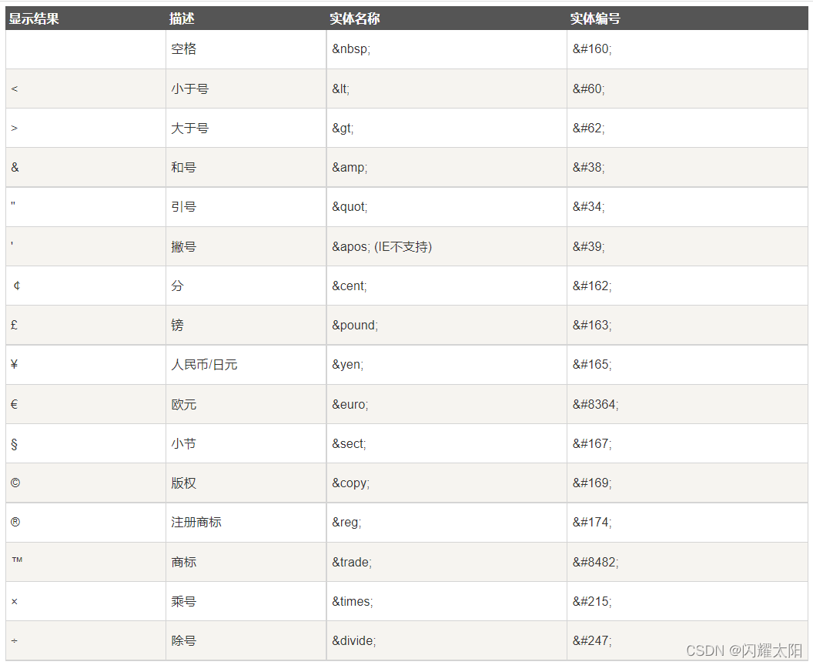

### HTML

**HTML( Hyper Text Markup Language)的全称为超文本标记语言**，是一种标记语言。它包括一系列标签．通过这些标签可以将网络上的文档格式统一，使分散的Internet资源连接为一个逻辑整体。HTML文本是由HTML命令组成的描述性文本，HTML命令可以说明文字，图形、动画、声音、表格、链接等。

#### 超文本

超文本是一种组织信息的方式，它通过超级链接方法将文本中的文字、图表与其他信息媒体相关联。这些相互关联的信息媒体可能在同一文本中，也可能是其他文件，或是地理位置相距遥远的某台计算机上的文件。这种组织信息方式将分布在不同位置的信息资源用随机方式进行连接，为人们查找，检索信息提供方便。

#### 标记语言

说HTML是一种『标记语言』因为它是由一系列`『标签』`组成的，没有常量、变量、流程控制、异常处理、IO等等这些功能。HTML很简单，每个标签都有它固定的含义和确定的页面显示效果。所以学习html比较简单,大家只需要记忆特定的标签语法即可

```html
<!-- 表示html5 -->
<!DOCTYPE html>
<html lang="en">
    <!--head头标签-->
    <head>
        <!--mata指定字符集标签-->
        <meta charset="utf-8">
        <title>hello</title>
    </head>
    <body>
        <h1>hello world!</h1>
    </body>
</html>
```

#### HTML页面结构

- 文档声明：HTML文件中第一行内容，用来告诉浏览器当前HTML文档的基本信息，其中最重要的就是当前HTML文档遵循的语法标准。

- HTML4版本的文档类型声明

```html
<!DOCTYPE HTML PUBLIC "-//W3C//DTD HTML 4.01 Transitional//EN"
	"http://www.w3.org/TR/html4/loose.dtd">   
```

- HTML5版本的文档类型声明

```html
<!DOCTYPE html>
```

- 根标签：html标签是整个文档的根标签，所有其他标签都必须放在html标签里面

- 头部：head标签用于定义文档的头部，其他头部元素都放在head标签里。头部元素包括title标签、script标签、style标签、link标签、meta标签等

- 主体：body标签定义了网页的主体内容，在浏览器窗口内显示的内容都定义到body标签内。

- HTML注释写法

```html
<!-- 注释内容 -->
```

#### HTML语法规则

- 根标签有且只能一个
- 无论是双标签还是单标签都必须正确关闭
- 标签可以嵌套但不能交叉嵌套
- 注释不能有嵌套
- 属性必须有值，值必须加引号，单引号或双引号
- 标签名不区分大小写

### HTML基础标签

#### 标题标签

- 从h1-h6个字体大小依次递减

```html
<!DOCTYPE html>
<html lang="en">
    <!--head头标签-->
    <head>
        <!--mata指定字符集标签-->
        <meta charset="utf-8">
        <title>hello</title>
    </head>
    <body>
        <!--标题标签-->
        <h1>hello world!</h1>
        <h2>hello world!</h2>
        <h3>hello world!</h3>
        <h4>hello world!</h4>
        <h5>hello world!</h5>
        <h6>hello world!</h6>
    </body>
</html>
```

#### 段落标签

```html
 <!--段落标签-->
 	<p>天青色等烟雨,而我在等你</p>
	<p>炊烟袅袅升起 隔江千万里</p>
```

#### 换行标签

- 在html中如果直接回车换行是不可以直接使用的，需要使用\</br>标签

```html
<!--换行标签-->
对酒当歌，<br>
人生几何？
```

#### 无序标签

```html
<!--无序标签-->
 <ul type="disc">
     	<li>语文</li>
 			<li>数学</li>
    	<li>英语</li>
</ul>
```

#### 有序标签

- type：表示类型
- start：表示启始位置

```html
			 <!--有序标签-->
        <ol type="A" start="3">
            <li><strong>语文</strong></li>
            <li>数学</li>
            <li>外语</li>
        </ol>
```

#### 超链接标签

- href属性，表示将要跳转的页面地址
- target属性：
  - _self：在当前页面打开
  - _blank：在新页面打开
  - _parent：级联标签父级页面
  - _top：级联标签顶部页面

```html
				<a href="www.baidu.com">百度</a>
        <a href="www.baidu.com" target="_bank">百度</a>
        <a href="www.baidu.com" target="_self">百度</a>
```

#### 图片标签

```html

```

#### 块级标签

块级标签并不是为了显示文章内容，而是为了方便结合css对页面进行布局。也称盒子模型

- 块级标签：块级标签独占一行前后都会回车换行符，如果设定大小，则大小固定div
- 行级标签：行级标签的大小由内容决定，通常由内容撑大，不会独占一行，会自动的向左看齐span

##### 块级标签浮动float

- 如果改变div中独占一行的效果，则必须添加浮动效果
- 浮动方向：
  - left
  - right

```html
<!DOCTYPE html>
<html lang="en">
    <head>
        <meta charset="utf-8">
        <title>块级标签用法</title>
    </head>
    <body>
        <div style="border: 1px red solid;width: 200px;height: 200px;">
            div标签
        </div>
        <div style="border: 1px green solid; width: 300px;height: 300px;">
            <div style="background-color: red;  width: 150px;height: 150px;float: left">这是内层盒子1</div>
      <div style="background-color: blue; width: 150px;height: 150px;float: right">这是内层盒子2</div>
      <div style="background-color: black;  width: 150px;height: 150px;float: left">这是内层盒子3</div>
      <div style="background-color: greenyellow; width: 150px;height: 150px;float: right">这是内层盒子4</div>
  </div>
   <span style="color: red; font-size: 80px">床前明月光,</span>
    <span style="color: blue;font-size: 60px">疑似地上霜.</span>
        
    </body>
</html>
```

#### HTML字符实体



#### 表格标签

```html
<!DOCTYPE html>
<html lang="en">
	<head>
		<meta charset="utf-8">
		<title>表格标签</title>
	</head>
	<body>
		<table border="1px" width="80%" height="400px" align="center">
			<tr>
				<th>ID</th>
				<th>姓名</th>
				<th>年龄</th>
				<th>性别</th>
			</tr>
			<tr align="center">
				<td>1</td>
				<td>张三</td>
				<td>20</td>
				<td>男</td>
			</tr>
			<tr>
            <!--跨四列-->
            <td colspan="4">跨列测试</td>
        </tr>
        <tr>
            <td rowspan="2">跨行测试</td>
            <td></td>
            <td></td>
            <td></td>
        </tr>
        <tr>
            <td></td>
            <td></td>
            <td></td>
        </tr>
		</table>
	</body>
</html>
```

#### 表单标签

##### form表单

- action：form表单将数据提交到服务器地址
- method：form表单的提交方式
- submit：只有type="submit"的按钮时，表单会主动提交

##### input标签

- type类型：
  - text：文本输入框
  - hidden：隐藏域
  - password：密码输入框
  - submit：提交按钮
  - radio：单选输入框
  - reset：重置按钮
  - date：时间输入框
  - checkbox：复选框
  - file：文件输入框
- name
- value

##### 下拉列表

- select标签
- option标签

##### 多行文本框

- textarea标签

```java
<!DOCTYPE html>
<html lang="en">
    <head>
        <meta charset="utf-8">
        <title>注册</title>
    </head>
    <body>
        <form action="register" method="post">
            姓   名:  <input type="text" name="username"/> <br/>
            密   码:  <input type="password" name="password"/> <br/>
            性   别：
            <input type="radio" name="gender" id="man" checked="checked" />
            <label for="man">男</label>
            <input type="radio" name="gender" id="woman"/>
            <label for="man">女</label> <br/>
            生   日:  <input type="date" name="birth"/> <br/>
            职   业:
            <select name="profession">
                <option value="">请选择</option>
                <option value="Java开发">Java开发</option>
                <option value="web开发">web开发</option>
                <option value="大数据开发">大数据开发</option>
            </select> <br/>
            爱   好:
            <input type="checkbox" name="hobbys" value="打游戏" checked="checked">打游戏 
            <input type="checkbox" name="hobbys" value="敲代码">敲代码 
            <input type="checkbox" name="hobbys" value="看电视">看电视 <br/>
            文   件:
            <input type="file" name="file"/><br/>
            个人简介: <textarea name="info" style="width=300px;height=100px;"></textarea> <br/>
            <input type="hidden" name="id" value="1000"/>
            <input type="submit" value="注册"/>
            <input type="reset" value="重填"/>
        </form>
    </body>
</html>
```

