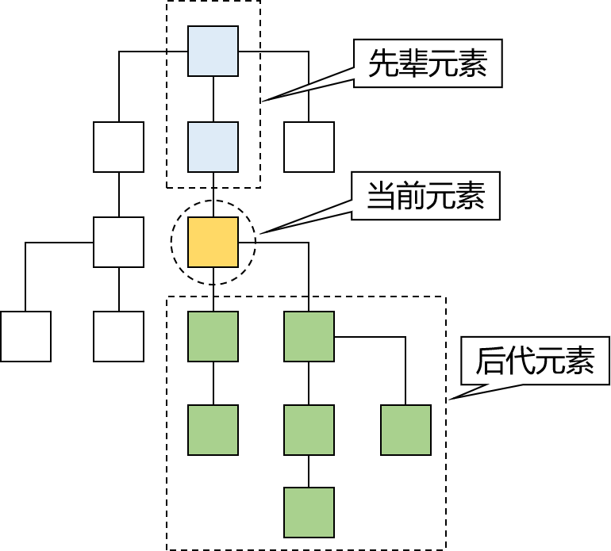

### JavaScript

JavaScript是一种具有函数优先的轻量级，解释形的编程语言。虽然它是作为开发web页面的脚本语言而出名，但是它也是被利用到了很多非浏览器环境中，JavaScritp基于原型编程、多范式的动态脚本语言，并且支持面向对象、命令式、函数式编程范式

#### JavaScript语言组成

- ECMAScript，描述了该语言的语法和基本对象
- 文档对象模型（DOM），描述处理网页内容的方法和接口
- 浏览器对象模型（BOM），描述与浏览器进行交互的方法和接口

#### JavaScript语言特点

- 脚本语言。javascript是一种解释形的脚本语言
- 基于对象。javascript是一种基于对象的脚本语言
- 简单。javascript语言中采用的是弱类型的变量类型
- 动态性。javascrip是一种采用事件驱动的脚本语言，它不需要经过web服务器就可以对用户的输入做出响应
- 跨平台性。javascript脚本语言不依赖于操作系统，仅需要浏览器支持

### 引入方式

#### 内部引用

- 使用script标签体引入js，js代码写到标签体的内部
- script标签体，可以放到任意的位置
- 为了能够方便查询或操作HTML标签script标签可以写在body标签后面

#### 外部引用

- 新建一个js文件，后缀为xxx.js
- 编写js文件
- 引入js文件

```js
window.onload = function(){
    var btn = document.getElementById("btn")
    btn.onclick = function(){
        alert("我是一个点击按钮")
    }
}
```

```html
<!DOCTYPE html>
<html lang="en">
    <head>
        <!--mata指定字符集标签-->
        <meta charset="utf-8">
        <title>js01</title>
        <script type="text/javascript" src="js/hello.js"></script>
    </head>
    <body>
        <h1>点击按钮出现弹窗效果</h1>
        <button onclick="onClick" id="btn">点击按钮</button>
    </body>
</html>
```

### JS中变量类型

#### 变量的声明

- 关键字：var
- 数据类型：JavaScript变量是弱类型的，可以接受任意的数据
- 表示符：严格区分大小写
- 变量使用规则
  - 如果使用了一个没有声明的变量，那么会在运行时报错
  - 如果声明了一个变量没有初始化，那么这个变量的值就是undefined

#### 基本数据类型

- 数值number
- 字符串String
- 布尔类型boolean
  - 在js中，其他类型和布尔类型的自动转换。
  - true：非零的数值，非空字符串，非空对象
  - false：零，空字符串，null，undefined

```js
if (null){
    alert("数据有效")
}else{
    alert("数据无效")
}
```

### JS中函数定义

#### 内置函数

- alert("xxx")
- confirm("xxx")
- console.log("xxxx")

```js
<script type="text/javascript">
  let flag = confirm("是否确定？")
  alert(flag)
  //在控制台输出函数
  console.log(flag)
</script>
```

#### 自定义函数

函数定义语法：

```js
function 函数名(参数列表){函数体}
```

- 无参无返回值函数定义

```js
	  <script type="text/javascript">
      /* 二 自定义函数 */

      /* 2.1 无参无返回值函数 function 函数名(参数列表) {函数体}*/
      function fun1(){
         alert("我是一个无参,无返回值函数")
      }
      //函数调用
      fun1()
    </script>
```

- 有参无返回值函数

```js
 	  /* 2.2 有参我返回值函数 */
      function fun2(num1,num2,num3){
          console.log("计算结果:"+ (num1+num2+num3))
      }
      fun2(100,200,300)
```

- 有参数有返回值定义

```js
 	  /* 2.3 有参有返回值函数 */
      function fun3(num1,num2,num3){
         return num1 + num2 + num3
      }
      let result = fun3(100,100,100)
      alert(result)
```

```js
function fun1(){
    console.log("fun1...")
}
fun1();

function fun2(i,j){
    console.log(i+j);
}
fun2(10,20);

function fun3(i,j){
    return i*j;
}
let sum = fun3(5,4);
alert(sum);
```

#### 匿名函数定义

```js
 	  	/* 3.匿名函数 */
      //3.1 匿名函数用法
      window.onload = function () {
        alert("这是一个典型的匿名函数")
      }

      //3.2 通过变量指定匿名函数  可以将函数看作是一个对象,之后赋值给fun4, 
      let fun4 = function () {
         alert("我是匿名函数的第二种写法")
      }
      fun4()
```

### JS中对象写法

#### new关键字

```js
let o = new Object()
o.id = 100;
o.name = "canvs";
o.age = 18;
console.log(o)  //Object { id: 100, name: "canvs", age: 18 }
o.hello = function(){
    console.log("hello " + o.name); //hello canvs
}
o.hello();
```

#### {}写法

```js
let o2 = {
    id: 101,
    name: "Tom",
    age: 20,
    hello: function(){
        console.log("hello " + this.name);
    }
}
console.log(o2);
o2.hello();
```

#### this关键字

- 在函数外边：this关键字指向window对象（代表当前浏览器窗口）

```js
console.log(this.alert("AAAA"));
```

- 在函数里面：this关键字指向当前对象

```js
let user = {
    id: 1001,
    name: "jerry",
    age: 20,
    getName:function(){
        return this.name;
    }
}
console.log(user.getName());
```

### 数组

#### 使用new关键字创建数组

```js
let array = new Array();
array[0] = 'a';
array[1] = 'b';
array[2] = 'c';
array[3] = 'd';
console.log(array); //Array(4) [ "a", "b", "c", "d" ]
```

#### 使用[]方式创建数组

```js
let arr = [1,2,3,4];
console.log(arr);   //Array(4) [ 1, 2, 3, 4 ]
```

#### 数组关键字

- push 向数组追加数据
- pop出栈
- reverse数组数据反转
- join数组拼接为字符串
- split字符串转换为数组
- splice删除数组数据

```js
array.push('e');
console.log(array);
//删除最后一位元素
array.pop();
console.log(array);

arr.reverse();
console.log(arr);   //Array(4) [ 4, 3, 2, 1 ]

let s = array.join();
console.log(typeof s);  //string

arr2 = s.split();
console.log(arr2)
arr2.splice();
console.log(arr2.length);   //1
```

### 循环遍历

#### for循环

```js
let arr3 = [4,2,5,6,1,7];
for(let i = 0; i < arr3.length; i++) {
    alert(arr3[i]);
}
```

#### 遍历属性/下标in关键字

```js
for(index in arr3){
    console.log(arr3[index])
}
```

#### 增强for-of

```js
for(num of arr3){
    console.log(num);
}
```

### JSON

JSON(JavaScript Object Notation) 是一种轻量级的数据交换格式。 易于人阅读和编写。同时也易于机器解析和生成。 它基于JavaScript Programming Language, Standard ECMA-262 3rd Edition - December 1999的一个子集。 JSON采用完全独立于语言的文本格式，但是也使用了类似于C语言家族的习惯（包括C, C++, C#, Java, JavaScript, Perl, Python等）。 这些特性使JSON成为理想的数据交换语言。

> 主要作用实现服务器之间数据交互，本质就是字符串

#### 格式：

- JSON对象格式
- JSON数组格式

#### JSON对象格式

```json
{"id":100,"name":"canvs","age":18}
```

#### Array数组格式

```json
["a","b","c","d"]
```

#### 嵌套结构

```json
[{"id":1,"name":"canvs","age":15},{"id":2,"name":"jerry","age":20},{"id":3},"name":"lisa","age":23]
```

#### JS中的JSON结构

JSON的数据结构和JS数据结构一脉相承，所以语法相同

```js
		<script type="text/javascript">
            //js对象
            let jsObject = {
                id:100,
                name:"canvs",
                age:20,
            }
            alert(jsObject.name);
            //json对象格式
            let jsonObject = {
                "id":101,
                "name":"tom",
                "age":18,
            }
            alert(jsonObject.name);
            //Array写法
            let array = ["a","b","c","d"];
            alert(array[0]);
        
            //嵌套格式的写法
            let object_array = {
                "id":100,
                "name":"tomcat",
                "hobbys":["吃鱼","吃肉","吃猫粮"],
            }
        console.log(object_array);
        </script>
```

#### JSON串与JSON对象转化

```js
 						let object_array = {
                "id":100,
                "name":"tomcat",
                "hobbys":["吃鱼","吃肉","吃猫粮"],
            }
            console.log(object_array);
            
            //json对象转化为字符串
            let str = JSON.stringify(object_array);
            console.log(typeof str);
            //json串转换为JSON对象
            let cat = JSON.parse(str);
            console.log(cat)
```

### DOM操作

#### JavaScript的DOM对象

DOM是Document Object Model的缩写，意思是『文档对象模型』——将HTML文档抽象成模型，再封装成对象方便用程序操作。

#### DOM树的概念

浏览器把HTML文档从服务器上下载下来之后就开始按照『从上到下』的顺序『读取HTML标签』。每一个标签都会被封装成一个『对象』

而第一个读取到的肯定是根标签html，然后是它的子标签head，再然后是head标签里的子标签……所以从html标签开始，整个文档中的所有标签都会根据它们之间的『父子关系』被放到一个 『树形结构』的对象中

#### 各个组成部分的类型

整个文档中的一切都可以看作Node。各个具体组成部分的具体类型可以看作Node类型的子类

> 其实严格来说，js并不支持真正意义上的继承，这里借用Java中的继承概念，从逻辑上来帮助我们理解个各个类型之间的关系

| 组成部分         | 节点类型 | 具体类型 |
| ---------------- | -------- | -------- |
| 整个文档         | 文档节点 | Document |
| HTML标签         | 元素节点 | Element  |
| HTML标签内的文本 | 文本节点 | Text     |
| HTML标签内的属性 | 属性节点 | Attr     |

#### 父子关系


#### 先辈后代关系



#### DOM操作

由于实际开时基本上都是使用JavaScript的各种框架来操作，而框架中的操作方式和我们看到的原生操作完全不同

##### 整个文档范围内查询元素节点

| 功能               | API                                    | 返回值             |
| ------------------ | -------------------------------------- | ------------------ |
| 根据id值查询       | document.getElementById("id值")        | 一个具体的元素节点 |
| 根据标签名查询     | document.getElementByTagName("标签名") | 元素节点数组       |
| 根据name属性值查询 | document.getElementByName("name值")    | 元素节点数组       |
| 根据类名查询       | document.getElementByClassName("类名") | 元素节点数组       |

```html
<!DOCTYPE html>
<html lang="en">
    <head>
        <!--mata指定字符集标签-->
        <meta charset="utf-8">
        <title>DOM</title>
       <script type="text/javascript">
            window.onload = function(){
                let p = document.getElementById("p1");
                //根据id获取元素
                console.log(p)  //<p id="p1" class="pClass" name="Pname">
                
                //根据标签名获取元素
                let pArray = document.getElementsByTagName("p");   
                console.log(pArray);
                
                //根据name属性获取元素
                let p2 = document.getElementsByName("pName");
                console.log(p2);
                
                //class属性获取元素
                let pClass = document.getElementsByClassName("pClass");
                console.log(pClass);
            }
       </script>
    </head>
    <body>
        <h1>DOM操作</h1>
        <p id="p1" name="pName" class="pClass">hello world 1</p>
        <p id="p2" name="pName" class="pClass">hello world 2</p>
    </body>
</html>
```

##### 在具体元素节点范围内查找子节点

| 功能               | API                       | 返回值         |
| ------------------ | ------------------------- | -------------- |
| 查找子标签         | element.children          | 返回子标签数组 |
| 查找第一个子标签   | element.firstElementChild | 标签对象       |
| 查找最后一个子标签 | element.lastElementChild  | 节点对象       |

```html
<!DOCTYPE html>
<html lang="en">
    <head>
        <!--mata指定字符集标签-->
        <meta charset="utf-8">
        <title>DOM</title>
       <script type="text/javascript">
            window.onload  = function(){
                //获取div1的子元素
                let childrens = document.getElementById("div1").children;
                console.log(childrens);
                
                let p1 = document.getElementById("div1").firstElementChild;
                console.log(p1);
            }
       </script>
    </head>
    <body>
        <h1>DOM操作</h1>
        <div id="div1">
            <p>java</p>
            <p>python</p>
            <p>c++</p>
        </div>
    </body>
</html>
```

##### 查找指定元素节点的父节点

| 功能                     | API                  | 返回值   |
| ------------------------ | -------------------- | -------- |
| 查找指定元素节点的父标签 | element.parenElement | 标签对象 |

##### 查找指定元素节点的兄弟节点

| 功能               | API                         | 返回值   |
| ------------------ | --------------------------- | -------- |
| 查找前一个兄弟标签 | node.previousElementSibling | 标签对象 |
| 查找后一个兄弟标签 | node.nextElementSibling     | 标签对象 |

##### 属性操作

| 需求       | 操作方式                   |
| ---------- | -------------------------- |
| 读取属性值 | 元素对象.属性名            |
| 修改属性值 | 元素对象.属性名=新的属性值 |

```html
<!DOCTYPE html>
<html lang="en">
    <head>
        <!--mata指定字符集标签-->
        <meta charset="utf-8">
        <title>DOM</title>
       <script type="text/javascript">
            window.onload = function(){
                //获取p标签中的属性值
                let p = document.getElementById("p1");
                console.log(p.id);
                console.log(p.name);
                console.log(p.getAttribute("name"));
                
                //获取文本信息
                console.log(p.innerText);
                
                //为属性和文本赋值
                p.id = "p2";
                p.setAttribute("name","pName2")
                p.innerText = "你好 世界"
                console.log(p);
            }
       </script>
    </head>
    <body>
        <h1>DOM操作</h1>
        <p id="p1" name="pName">helloworld</p>
    </body>
</html>
```

##### 标签体的操作

| 需求                         | 操作方式          |
| ---------------------------- | ----------------- |
| 获取或者设置标签体的文本内容 | element.innerText |
| 获取或者设置标签体的内容     | element.innerHTML |

##### DOM增删改操作

| API                                      | 功能                                       |
| ---------------------------------------- | ------------------------------------------ |
| document.createElement(“标签名”)         | 创建元素节点并返回，但不会自动添加到文档中 |
| document.createTextNode(“文本值”)        | 创建文本节点并返回，但不会自动添加到文档中 |
| element.append(ele)                      | 将ele添加到element元素中                   |
| element.appendChild(ele)                 | 将ele添加到element所有子节点后面           |
| parentEle.insertBefore(newEle,targetEle) | 将newEle插入到targetEle前面                |
| parentEle.replaceChild(newEle, oldEle)   | 用新节点替换原有的旧子节点                 |
| element.remove()                         | 删除某个标签                               |

```html
<!DOCTYPE html>
<html lang="en">
<head>
    <meta charset="UTF-8">
    <title>Title</title>
    <script>
        window.onload = function (){
            //写法1:
            //1.创建tr标签
            let trEle = document.createElement("tr")
            trEle.setAttribute("align","center")

            //2.创建td标签
            let tdEle1 = document.createElement("td")
            tdEle1.innerText = 200
            let tdEle2 = document.createElement("td")
            tdEle2.innerText = "李四"
            let tdEle3 = document.createElement("td")
            tdEle3.innerText = 18

            //3.将td追加到tr标签中
            trEle.append(tdEle1,tdEle2,tdEle3)
            console.log(trEle)

            //4.将tr标签追加到table中
            document.getElementById("tab1").append(trEle)

            //写法2:  利用innerHtml的方式简化代码
            let tr2 = document.createElement("tr")
            tr2.setAttribute("align","center")
            //定义的html的字符串
            let tds = "<td>300</td><td>麻子</td><td>20</td>"
            // <tr>
            //   <td>300</td><td>麻子</td><td>20</td>
            // </tr>
            tr2.innerHTML = tds
            document.getElementById("tab1").append(tr2)

        }
    </script>
</head>
<body>
    <h1>DOM操作</h1>
    <table id="tab1" border="1px" cellpadding="0" cellspacing="0" width="500px">
        <tr>
            <th>编号</th>
            <th>名称</th>
            <th>年龄</th>
        </tr>
        <tr align="center">
            <td>100</td>
            <td>张三</td>
            <td>18</td>
        </tr>
    </table>
</body>
</html>
```

### JavaScript事件驱动

- HTML事件是发生在HTML元素上的事情，是浏览器或用户做的某些事情
- 事件通常与函数配合使用，这样就可以通过发生的事件来驱动函数执行

#### 常见事件

| 属性        | 事件发生在何时                       |
| ----------- | ------------------------------------ |
| onclick     | 当用户点击某个对象时调用的事件句柄。 |
| ondblclick  | 当用户双击某个对象时调用的事件句柄。 |
| onchange    | 域的内容被改变。 离焦时触发          |
| onblur      | 元素失去焦点。                       |
| onfocus     | 元素获得焦点。                       |
| onload      | 一张页面或一幅图像完成加载。         |
| onsubmit    | 确认按钮被点击；表单被提交。         |
| onkeydown   | 某个键盘按键被按下。                 |
| onkeyup     | 某个键盘按键被松开。                 |
| onmousedown | 鼠标按钮被按下。                     |
| onmouseup   | 鼠标按键被松开。                     |
| onmouseout  | 鼠标从某元素移开。                   |
| omouseover  | 鼠标移到某元素之上。                 |
| onmousemove | 鼠标在某元素上移动时(位置改变时)触发 |

```html
<!DOCTYPE html>
<html lang="en">
    <head>
        <!--mata指定字符集标签-->
        <meta charset="utf-8">
        <title>DOM</title>
       <script type="text/javascript">
            function myClick(){
                alert("我是点击事件！")
            }
       </script>
    </head>
    <body>
       <button onclick="myClick()">点击时触发</button>
    </body>
</html>
```

```html
<!DOCTYPE html>
<html lang="en">
    <head>
        <!--mata指定字符集标签-->
        <meta charset="utf-8">
        <title>DOM</title>
       <script type="text/javascript">
            function myClick(){
                alert("我是点击事件！")
            }
            function myChange(){
                alert("数据修改之后，离焦时触发")
            }
            function myBlur(){
                alert("离焦时触发")
            }
            function myOnmouseover(){
                window.location.href="http://www.baidu.com"
            }
       </script>
    </head>
    <body>
       <button onclick="myClick()">点击时触发</button>
    <button ondblclick="myClick()">双击时触发</button><br>
    用户名:  <input type="text" name="username" onchange="myChange()">
    密码:  <input type="password" name="password" onblur="myBlur()"><br>
    <!--鼠标移动上去开始触发-->
    

    </body>
</html>
```

