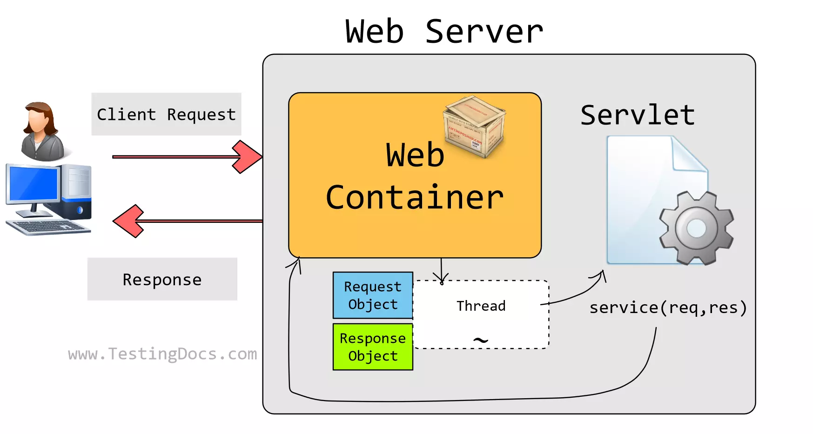
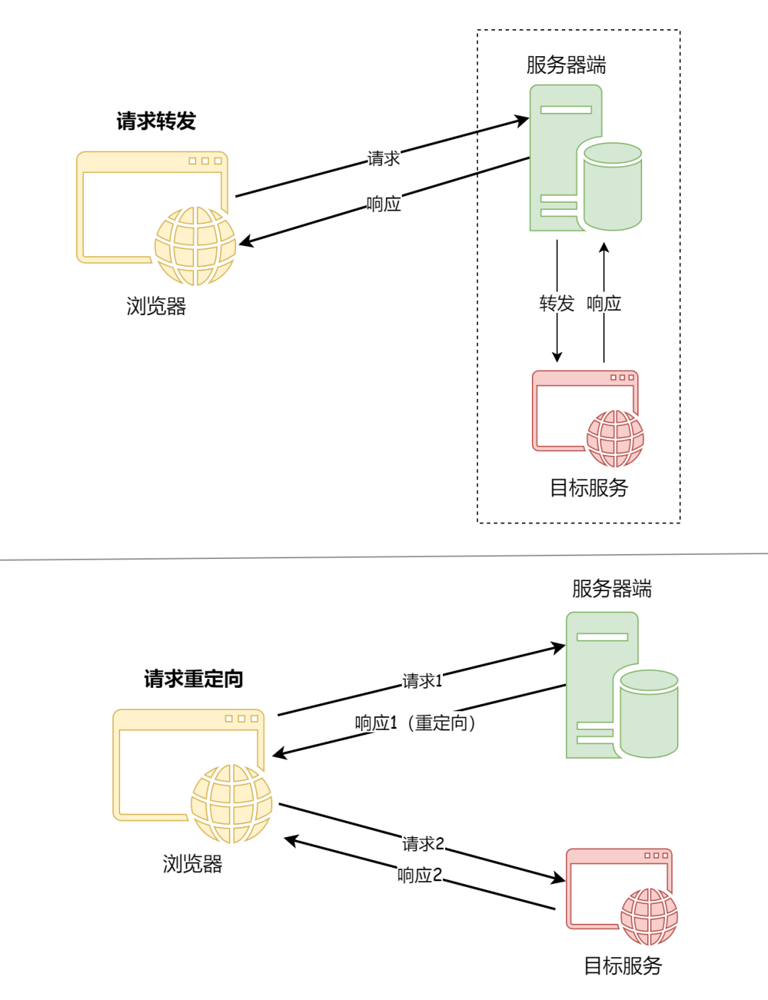

### Servlet

Servlet（Server Applet）是Java Servlet的简称，称为小服务程序或服务连接器，用Java编写的服务器端程序，具有独立于平台和协议的特性，主要功能在于交互式地浏览和生成数据，生成动态Web内容。 是java实现前后端交互的主要机制.

#### 工作原理



- 客户端发起http请求
- Servlet机制接收用户请求，并且交给后端业务进行处理
- 业务层根据逻辑实现数据CRUD操作

##### AddServlet

```Java
public class AddServlet extends HttpServlet {
    @Override
    protected void doPost(HttpServletRequest req, HttpServletResponse resp) throws ServletException, IOException {
        //设置编码格式
        req.setCharacterEncoding("utf-8");
        String id = req.getParameter("id");
        String name = req.getParameter("name");
        String email = req.getParameter("email");
        Customer cust = new Customer(Integer.parseInt(id), name, email, new Date(16737635569L));
        CustomerDAOImpl dao = new CustomerDAOImpl();
        Connection conn = null;
        try {
            conn = JDBCUtils.getConnection();
            dao.insert(conn,cust);
        } catch (Exception e) {
            e.printStackTrace();
        }finally {
            JDBCUtils.closeResource(conn,null);
        }
    }
}
```

##### web.xml配置文件

```xml
 	<servlet>
        <servlet-name>AddServlet</servlet-name>
        <servlet-class>com.canvs.servlets.AddServlet</servlet-class>
    </servlet>
    <servlet-mapping>
        <servlet-name>AddServlet</servlet-name>
        <url-pattern>/add</url-pattern>
    </servlet-mapping>
```

##### add.html文件

```html
<!DOCTYPE html>
<html lang="en">
<head>
    <meta charset="UTF-8">
    <title>Login</title>
</head>
<body>
<form action="add" method="post">
    编号:  <input type="text" name="id"/><br/>
    姓名: <input type="text" name="name"/><br/>
    邮箱: <input type="text" name="email"/><br/>
    生日: <input type="text" name="birth"/><br/>
    <input type="submit" value="提交">
</form>
</body>
</html>
```

### Servlet生命周期

#### Servlet对象的创建：构造器

- 默认情况下，Servlet容器第一次收到HTTP请求时创建对应Servlet对象
- 容器之所以能做到这一点是由于我们在注册Servlet时提供了全类名，容器使用反射技术创建了Servlet的对象

#### Servlet对象初始化：init()

- Servlet容器创建Servlet对象之后，会调用init(ServletConfig config)方法
- 作用：是在Servlet对象创建后，执行一些初始化操作。如：读取资源文件、配置文件，或建立某种连接（数据库连接）
- init()方法只在创建对象时执行一次，以后再接收到请求时，就不执行了
- 在javax.servlet.Servlet接口中，public void init(ServletConfig config)方法要求容器将ServletConfig的实例对象传入ServletConfig的实例对象的根本方法

#### 处理请求：service()

- 在javax.servlet.Servlet接口中，定义了service(ServletRequest req, ServletResponse res)方法处理HTTP请求
- 在每次接受到请求后都会执行。
- 同时要求容器将ServletRequest对象和ServletResponse对象传入

#### Servlet对象销毁：destruy()

- 服务器重启、服务器停止执行或Web应用卸载时会销毁Servlet对象，会调用public void destroy()方法
- 次方法用于销毁之前执行一些如释放缓存、关闭连接、保存内容数据持久化等操作。

```java
public class HelloServlet implements Servlet {
    @Override
    public void init(ServletConfig servletConfig) throws ServletException {
        System.out.println("init...");
    }
    @Override
    public ServletConfig getServletConfig() {
        return null;
    }
    @Override
    public void service(ServletRequest servletRequest, ServletResponse servletResponse) throws ServletException, IOException {
        System.out.println("hello service...");
    }
    @Override
    public String getServletInfo() {
        return null;
    }
    @Override
    public void destroy() {
        System.out.println("destroy...");
    }
}
```

```xml
   <servlet>
        <servlet-name>HelloServlet</servlet-name>
        <servlet-class>com.canvs.servlets.HelloServlet</servlet-class>
    </servlet>
    <servlet-mapping>
        <servlet-name>HelloServlet</servlet-name>
        <url-pattern>/hello</url-pattern>
    </servlet-mapping>
```

#### Servlet请求过程

- 第一次请求
  - 调用构造器，创建对象
  - 执行init()方法
  - 执行service()方法
- 后面请求
  - 执行service()方法
- 对象销毁前
  - 执行destroy()方法

#### Servlet使用方法

**GenericServlet**

- 使用GenericServlet只需要编写service()方法即可

```java
@WebServlet("/generic")
public class GenericServletTest extends GenericServlet {

    @Override
    public void service(ServletRequest servletRequest, ServletResponse servletResponse) throws ServletException, IOException {
        System.out.println("hello GenericServlet");
    }
}
```

**HttpServlet**

- 使用HttpServlet只需要专注GET/POST请求即可

```java
@WebServlet("/http")
public class HttpServletTest extends HttpServlet {
    @Override
    protected void doGet(HttpServletRequest req, HttpServletResponse resp) throws ServletException, IOException {
        System.out.println("hello HttpServlet");
    }
}
```

### Servlet中接口调用

#### ServletConfig接口

每个Servlet都有各自的ServletConfig对象

- ServletConfig接口封装了Servlet配置信息，这一点从接口的名称上就能够看出来
- 每一个Servlet都有一个唯一对应的ServletConfig对象，代表当亲啊Servlet的配置信息
- 对象由Servlet容器创建，并传入生命周期方法init(ServletConfig config)中。可以直接获取使用
- 代表当前Web应用的ServletContext对象也封装到了ServletConfig对象中，使ServletConfig对象成功为了获取ServletContext对象的一座桥梁
- ServletConfig对象的主要功能
  - 获取Servlet名称：getServletName()
  - 获取全局上下文ServletContext对象：getServletContext()
  - 获取Servlet初始化参数：getInitParameter(String)/getInitParameterNames();

```xml
<servlet>
        <servlet-name>HelloServlet</servlet-name>
        <servlet-class>com.canvs.servlets.HelloServlet</servlet-class>
        <init-param>
            <param-name>url</param-name>
            <param-value>jdbc:mysql://bj-cynosdbmysql-grp-an5acmhk.sql.tencentcdb.com:28067/demo?serverTimezone=UTC</param-value>
        </init-param>
        <init-param>
            <param-name>driverClass</param-name>
            <param-value>com.mysql.cj.jdbc.Driver</param-value>
        </init-param>
        <init-param>
            <param-name>user</param-name>
            <param-value>root</param-value>
        </init-param>
        <init-param>
            <param-name>password</param-name>
            <param-value>Lbwnb123</param-value>
        </init-param>
    </servlet>
    <servlet-mapping>
        <servlet-name>HelloServlet</servlet-name>
        <url-pattern>/hello</url-pattern>
    </servlet-mapping>
```

```Java
public class HelloServlet implements Servlet {
    @Override
    public void init(ServletConfig servletConfig) throws ServletException {
        System.out.println("init...");
        String url = servletConfig.getInitParameter("url");
        String driverClass = servletConfig.getInitParameter("driverClass");
        String user = servletConfig.getInitParameter("user");
        String password = servletConfig.getInitParameter("password");
  			System.out.println("url = "+url);
        System.out.println("driverClass = "+driverClass);
        System.out.println("user = "+user);
        System.out.println("password = "+password);
    }
    @Override
    public ServletConfig getServletConfig() {
        return null;
    }
    @Override
    public void service(ServletRequest servletRequest, ServletResponse servletResponse) throws ServletException, IOException {
        System.out.println("hello service...");
    }
    @Override
    public String getServletInfo() {
        return null;
    }
    @Override
    public void destroy() {
        System.out.println("destroy...");
    }
}
```

#### ServletContext接口

- Web容器在启动时，它会为每个web应用都创建一个唯一对应的ServletContext对象，意思是Servlet上下文，代表当前Web应用

- 由于一个Web应用程序中的所有Servlet都共享同一个ServletContext对象，所有ServletContext对象也被称为application对象（Web应用程序对象）

- 对象由Servlet容器在项目启动时创建，通过ServletConfig对象的getServletContext()方法获取，在项目卸载时销毁

- ServletContext对象的主要功能

  - 获取项目的上下文路径(带/的项目名)：getContextPath()

  ```java
      @Override
      public void init(ServletConfig servletConfig) throws ServletException {
          //获取ServletContext全局上下文对象
          ServletContext context = servletConfig.getServletContext();
          System.out.println("context = "+context);
          String contextPath = context.getContextPath();
          System.out.println("contextPath = "+contextPath);  //contextPath = /servlet
      }
  ```

  - 获取虚拟路径所映射的本地真实路径：getRealPath(String path)
    - 虚拟路径：浏览器访问Web应用中资源时所使用的路径
    - 本地路径：资源在文件系统中的实际保存路径
    - 作用：将用户上传的文件通过流写入到服务器硬盘中

  ```java
   @Override
      public void init(ServletConfig servletConfig) throws ServletException {
          ServletContext context = servletConfig.getServletContext();
          //获取index.html本地路径 index.html虚拟路径是/index.html;/表示当前web应用的根目录即WebContent目录
          String realPath = context.getRealPath("/index.html");
          System.out.println("relation"+realPath);
      }
  ```

  - 获取WEB应用程序的全局初始化参数

    - 设置Web应用初始化参数的方式是在web.xml的根标签下加入如下代码

    ```java
    <web-app>
    		<!--设置WEB应用全局参数-->
        <context-param>
            <param-name>name</param-name>
            <param-value>canvs</param-value>
        </context-param>
    </web-app>
    ```

    - 获取Web应用初始化参数

    ```java
       @Override
        public void init(ServletConfig servletConfig) throws ServletException {
            ServletContext context = servletConfig.getServletContext();
            //获取Web应用初始化参数
            String name = context.getInitParameter("name");
            System.out.println("全局初始化参数"+name);
        }
    ```

    - 作用域对象共享数据

      - 作为最大的域对象在整个项目的不同web资源内共享数据

      - setAttribute(key,value)：以后可以在任意位置取出使用
      - getAttribute(key)：取出设置的value值

### HttpServletRequest接口

- 该接口是ServletRequest接口的子接口，封装了HTTP请求的相关信息。
- 浏览器请求服务器时会封装请求报文交给服务器，服务器接受到请求会将请求报文解析生成request对象
- 由Servlet容器创建其实现类对象并传入service(HttpServletRequest req, HttpServletResponse res)方法中
- HttpServletRequest对象指的是容器提供的HttpServletRequest实现类对象

#### 获取请求参数

- 请求参数就是浏览器向服务器提交的数据
- 附在url后面(和get请求一致，拼接的形式请求数据绑定)
- 通过表单提交

```html
<form action="add" method="post">
    编号:  <input type="text" name="id"/><br/>
    姓名: <input type="text" name="name"/><br/>
    邮箱: <input type="text" name="email"/><br/>
    生日: <input type="text" name="birth"/><br/>
    <input type="submit" value="提交">
</form>
```

- 使用HttpServletRequest对象获取请求参数

```java
protected void doPost(HttpServletRequest req, HttpServletResponse resp) throws ServletException, IOException {
        //设置编码格式
        req.setCharacterEncoding("utf-8");
        String id = req.getParameter("id");
        String name = req.getParameter("name");
        String email = req.getParameter("email");
}
```

```java
//一个hobby对应一组值
String[] parameterValues = req.getParameterValues("hobby");
```

#### 获取url地址参数

```java
@WebServlet("/hello5")
public class HelloServlet5 extends HttpServlet {
    @Override
    protected void doGet(HttpServletRequest req, HttpServletResponse resp) throws ServletException, IOException {
        //获取url地址参数
        String contextPath = req.getContextPath();
        System.out.println("contextPath"+contextPath);
        System.out.println("端口号: "+req.getServerPort());
        System.out.println("主机名： "+req.getServerName());
        System.out.println("协议： "+req.getScheme());
    }
}
```

#### 获取请求头信息

```java
 //获取请求头信息
        String header = req.getHeader("User-Agent");
        System.out.println("User-Agent = "+header);
        System.out.println("上个页面的地址 = "+req.getHeader("Referer"));
```

#### 请求的转发

```java
@WebServlet("/hello6")
public class HelloServlet6 extends HttpServlet {
    @Override
    protected void doGet(HttpServletRequest req, HttpServletResponse resp) throws ServletException, IOException {
        //请求的转发
        RequestDispatcher dispatcher = req.getRequestDispatcher("success.html");
        dispatcher.forward(req,resp);
    }
}
```

#### 向请求域中保存数据

```java
@WebServlet("/hello7")
public class HelloServlet7 extends HttpServlet {
    @Override
    protected void doGet(HttpServletRequest req, HttpServletResponse resp) throws ServletException, IOException {
        //向请求域中保存数据
        req.setAttribute("attrName","attrValue");
        req.getRequestDispatcher("/hello8").forward(req,resp);
    }
}

@WebServlet("/hello8")
public class HelloServlet8 extends HttpServlet {
    @Override
    protected void doGet(HttpServletRequest req, HttpServletResponse resp) throws ServletException, IOException {
        Object attrName = req.getAttribute("attrName");
        System.out.println("attrName = "+attrName);
    }
}
```

### HttpServletResponse接口

- 该接口时ServletResponse接口的子接口，封装了服务器针对于HTTP响应的相关信息
- 由Servlet容器创建其实现类对象，并传入service(HttpServletRequest req,HttpServletResponse res)方法中
- HttpServletResponse对象指的是容器提供的HttpServletResponse实现类对象

#### 使用PrintWriter对象向浏览器输出数据

```java
@WebServlet("/hello9")
public class HelloServlet9 extends HttpServlet {
    @Override
    protected void doGet(HttpServletRequest req, HttpServletResponse resp) throws ServletException, IOException {
        PrintWriter pw = resp.getWriter();
        pw.println("Servlet response!");
        pw.println("Hello World!");
        pw.close();
    }
}
```

- 写出的数据可以是页面、页面片段、字符串等
- 当写出的数据包含中文时，浏览器接收到响应数据就可能有乱码。为了避免乱码，可以使用Response对象在向浏览器输出数据前设置响应头

#### 设置响应头

- 响应头就是浏览器解析页面的配置。如：告诉浏览器使用哪种编码和文件格式解析响应体内容

```java
 resp.setHeader("Conten-Type","text/html;charset=UTF-8");
```

#### 重定向请求

- 实现请求重定向
- 应用：用户从login.html页面提交登录请求数据给LoginServlet处理。如果账号密码正确，需要让用户跳转到成功页面，通过servlet响应体中写入成功页面过于复杂，通过重定向将成功页面的地址交给浏览器并设置状态码为302，浏览器会自动进行跳转
- HttpServletResponse代表HTTP响应，对象由Servlet容器创建
- 功能：
  - 向浏览器输出数据
  - 重定向请求
- 重定向的响应报文的头

```xml
HTTP/1.1 302 Found
Location: success.html
```

```html
<!DOCTYPE html>
<html lang="en">
<head>
    <meta charset="UTF-8">
    <title>Login</title>
</head>
<body>
<form action="/servlet/login" method="post">
  账 号: <input type="text" name="username"/> <br/>
  密 码: <input type="password" name="password"/> <br/>
  <input type="submit" value="登录">
</form>
</body>
</html>
```

```html
<!DOCTYPE html>
<html lang="en">
<head>
    <meta charset="UTF-8">
    <title>success</title>
</head>
<body>
<center>
    <h1>Login successful</h1>
</center>
</body>
</html>
```

```html
<!DOCTYPE html>
<html lang="en">
<head>
    <meta charset="UTF-8">
    <title>failed</title>
</head>
<body>
<center>
    <h1>Login failed</h1>
</center>
</body>
</html>
```

```java
@WebServlet("/login")
public class LoginServletRedirect extends HttpServlet {
    //登录重定向
    @Override
    protected void doPost(HttpServletRequest req, HttpServletResponse resp) throws ServletException, IOException {
        String username = req.getParameter("username");
        String password = req.getParameter("password");
        if (username.equals("canvs") && password.equals("123456")){
           resp.sendRedirect("/servlet/success.html");
        }else {
            resp.sendRedirect("/servlet/failed.html");
        }
    }
}
```

#### 请求的转发

- 第一个Servlet接收到浏览器端的请求，进行了一定的处理，然后没有立即对请求进行响应，而是将请求交给下一个Servlet继续处理，下一个Servlet处理完成之后对浏览器进行了响应。在服务器内部将请求交给其他组件继续处理就是请求的转发。
- HttpServletRequest代表HTTP请求，对象由Servlet容器创建。转发的请求下，两个Servlet可以共享同一个Request对象中保存的数据
- 转发的情况下，可以访问WEB-INF下的资源
- 转发以/开始表示项目根路径，重定向以/开始表示主机地址
- 功能：
  - 获取请求参数
  - 获取请求路径即URL地址相关信息
  - 在请求域中保存数据
  - 转发请求

```java
@WebServlet("/login2")
public class LoginServletForword extends HttpServlet {
    @Override
    protected void doPost(HttpServletRequest req, HttpServletResponse resp) throws ServletException, IOException {
        String username = req.getParameter("username");
        String password = req.getParameter("password");
        if (username.equals("canvs")&&password.equals("123456")){
            req.setAttribute("statusCode","success");
            req.getRequestDispatcher("/login3").forward(req,resp);
        }else {
            req.setAttribute("statusCode","failed");
            req.getRequestDispatcher("/login3").forward(req,resp);
        }
    }
}
```

```java
@WebServlet("/login3")
public class LoginServletForword2 extends HttpServlet {
    @Override
    protected void doPost(HttpServletRequest req, HttpServletResponse resp) throws ServletException, IOException {
        String statusCode = (String) req.getAttribute("statusCode");
        System.out.println(statusCode);
        PrintWriter pw = resp.getWriter();
        if (statusCode == null) {
            pw.println("404 not found!");
        }
        if (statusCode.equals("success")) {
            pw.println("Login success!");
        } else if (statusCode.equals("failed")) {
            pw.println("Login failed");
        }
    }
}
```

#### 转发和重定向说明

请求的转发与重定向是web应用页面跳转的主要手段，在Web应用中使用非常广泛。所以一定要搞清楚它们的区别

##### 定义不同

- 请求转发（Forward）：发生在服务器程序内部，当服务器端收到一个客户端的请求之后，会先将，转发给目标地址，再将目标地址返回的结果转发给客户端。而客户端对于这一切毫无感知。
- 请求重定向（Redirect）：请求重定向指的是服务器端接收到客户端的请求之后，会给客户端返回一个临时响应头，这个临时响应头中记录了，客户端需要再次发送请求（重定向）的URL地址，客户端再收到了地址之后，会将请求发送到新的地址上。

##### 请求方式不同

- 请求转发是服务器端的行为，服务器端代替客户端端发送请求，并将结果返回给客户端；而请求重定向是客户端的行为

##### 数据共享不同

- 请求转发是服务器端实现的，所以整个执行过程中，客户端只需要发送一次请求，因此整个交互过程中使用的都是同一个Request请求对象和一个Response响应对象，所以整个请求过程中，请求和返回的数据是共享的；而请求重定向向客户端发送两次完全不同的请求，所以两次请求中的数据是不同的

##### 最终URL地址不同

- 请求转发是服务器端代为请求，再将结果返回给客户端的，所以整个请求过程中URL地址是不变的；而请求重定向是服务器端告诉客户端，“你去另一个地方访问”，所以浏览器会重新再发送一次请求，因此客户端最终显示的URL也为最终跳转的地址，而非刚开始请求的地址，所以URL地址发生了改变



|                         | 转发                             | 重定向                                                |
| ----------------------- | -------------------------------- | ----------------------------------------------------- |
| 浏览器感知              | 在服务器内部完成，浏览器感知不到 | 服务器以302状态码通知浏览器访问新的地址，浏览器有感知 |
| 浏览器地址栏            | 不改变                           | 改变                                                  |
| 整个过程发送请求次数    | 一次                             | 两次                                                  |
| 能否共享request对象数据 | 能                               | 否                                                    |
| WEB-INF下的资源         | 能访问                           | 不能访问                                              |
| 目标资源                | 必须是当前web应用中的资源        | 不局限于当前web应用                                   |

