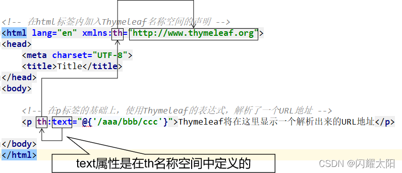
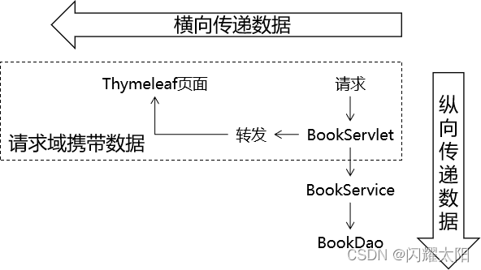
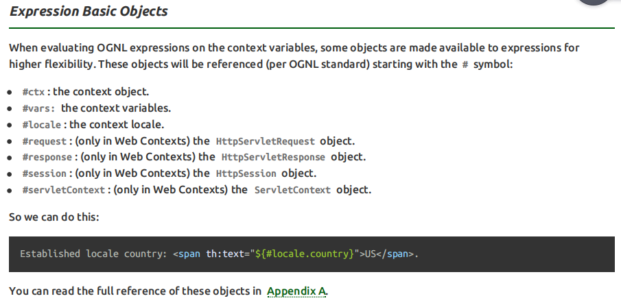
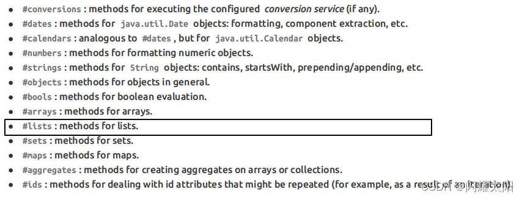
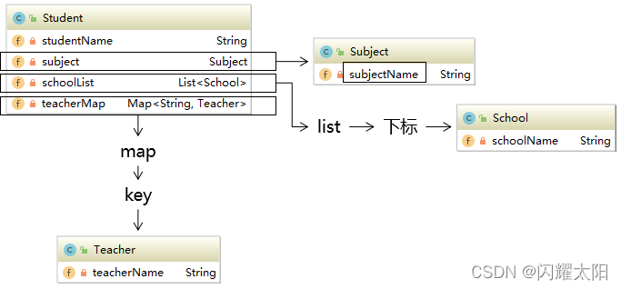
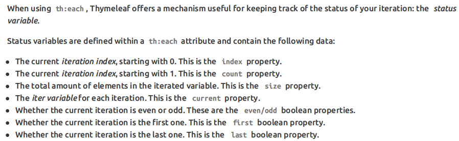

### Thymeleaf

Thymeleaf是一款用于渲染XML/XHTML/HTML5内容的模版引擎。类似于JSP、Velocity等

#### Thymeleaf优势

- SpringBoot官方推荐使用的视图模版技术，和SpringBoot完美结合
- 不经过服务器运算仍然可以直接查看原始值

### 物理视图和逻辑视图

#### 物理视图

在Servlet中，将请求转发到一个HTML页面文件时，使用的完整的转发路径就是物理视图

```xml
/pages/user/login.html
/pages/user/login_success.html
/pages/user/regist.html
/pages/user/regist_success.html
……
```

- 视图前缀：/pages/user/

- 视图后缀：.html

#### 逻辑视图

物理视图=视图前缀+逻辑视图+视图后缀

| 视图前缀     | 逻辑视图      | 视图后缀 | 物理视图                       |
| ------------ | ------------- | -------- | ------------------------------ |
| /pages/user/ | login         | .html    | /pages/user/login.html         |
| /pages/user/ | login_success | .html    | /pages/user/login_success.html |

### Thymeleaf入门demo

#### 导入jar包

3.0.12.RELEASE版本

#### 配置上下文参数

**web.xml**

```xml
<?xml version="1.0" encoding="UTF-8"?>
<web-app xmlns="http://xmlns.jcp.org/xml/ns/javaee"
         xmlns:xsi="http://www.w3.org/2001/XMLSchema-instance"
         xsi:schemaLocation="http://xmlns.jcp.org/xml/ns/javaee http://xmlns.jcp.org/xml/ns/javaee/web-app_4_0.xsd"
         version="4.0">
    <!--  视图前缀  -->
    <context-param>
        <param-name>view-prefix</param-name>
        <param-value>/WEB-INF/view/</param-value>
    </context-param>
    <!--  视图后缀  -->
    <context-param>
        <param-name>view-suffix</param-name>
        <param-value>.html</param-value>
    </context-param>
</web-app>
```

> param-value中设置的前缀、后缀的值不是必须叫这个名字，可以根据实际情况和需求进行修改
>
> WEB-INF目录不允许浏览器直接访问，所以视图模版文件放在这个目录下，是一种保护。以免外界可以随意访问视图模版文件
>
> 访问WEB-INF目录下的页面，都必须通过Servlet转发过来

#### 创建Servlet基类

```java
public class ViewBaseServlet extends HttpServlet {
    private TemplateEngine templateEngine;
    @Override
    public void init() throws ServletException {
        //1.获取ServletContext对象
        ServletContext servletContext = this.getServletContext();
        //2.创建Thymeleaf解析器对象
        ServletContextTemplateResolver templateResolver = new ServletContextTemplateResolver(servletContext);
        //3.给解析器对象设置参数
        //3.1HTML是默认模式，明确设置是为了代码更容易理解
        templateResolver.setTemplateMode(TemplateMode.HTML);
        //3.2设置前缀
        String viewPrefix = servletContext.getInitParameter("view-prefix");
        templateResolver.setPrefix(viewPrefix);
        //3.3设置后缀
        String viewSuffix = servletContext.getInitParameter("view-suffix");
        templateResolver.setSuffix(viewSuffix);
        //3.4设置缓存过期时间（毫秒）
        templateResolver.setCacheTTLMs(60000L);
        //3.5设置是否缓存
        templateResolver.setCacheable(true);
        //3.6设置服务器端编码方式
        templateResolver.setCharacterEncoding("utf-8");
        //4 创建模版引擎对象
        templateEngine = new TemplateEngine();
        //5 给模版引擎对象设置模版解析器
        templateEngine.setTemplateResolver(templateResolver);
    }
    protected void processTemplate(String templateName, HttpServletRequest req, HttpServletResponse resp) throws IOException {
        //1 设置响应体内容类型和字符集
        resp.setContentType("text/html;charset=UTF-8");
        //2 创建WebContext对象
        WebContext webContext = new WebContext(req, resp, getServletContext());
        //3.处理模版数据
        templateEngine.process(templateName,webContext,resp.getWriter());
    }
}
```

#### 创建index.html页面

```html
<!DOCTYPE html>
<html lang="en">
<head>
    <meta charset="UTF-8">
    <title>index</title>
    <base href="http://127.0.0.1:8080/thymeleaf/"/>
</head>
<body>
    <a href="helloServlet"> 跳转到helloServlet </a>
</body>
</html>
```

#### 创建HelloServlet

```java
@WebServlet("/helloServlet")
public class HelloServlet extends ViewBaseServlet{
    @Override
    protected void doGet(HttpServletRequest req, HttpServletResponse resp) throws ServletException, IOException {
        doPost(req,resp);
    }
    @Override
    protected void doPost(HttpServletRequest req, HttpServletResponse resp) throws ServletException, IOException {
        System.out.println("已经访问了Servlet了。。。");
        req.setAttribute("msg","我是服务器数据");
        this.processTemplate("hello",req,resp);
    }
}

```

#### 创建Thymeleaf

**WEB-INF/view/hello.html**

```html
<!DOCTYPE html>
<html lang="en" xmlns:th="http://www.thymeleaf.org">
<head>
    <meta charset="UTF-8">
    <title>hello</title>
</head>
<body>
  <h1 th:text="${msg}"></h1>
</body>
</html>
```

### Thymeleaf基本语法

#### base标签用法

- base标签可以将公共的路径进行抽取
  - base标签必须位于head标签内部
- 使用base标签之后，会对其他路径产生影响，a标签/form表单/img标签
- 使用base标签后，其余标签不能以 / 开头，否则按照自己的路径跳转

```html
<!DOCTYPE html>
<html lang="en">
<head>
    <meta charset="UTF-8">
    <title>Title</title>
    <base href="/day08_2_url/">
</head>
<body>
   <a href="a/A.html">访问A页面</a>
   <a href="a/b/B.html">访问B页面1</a>
   <a href="/a/b/B.html">访问B页面2</a> <!--错误写法-->
</body>
</html>
```

#### th名称空间



#### th:text作用

```html
<p th:text="标签体新值">标签体原始值</p>
```

- 不经过服务器解析，直接用浏览器打开HTML文件，看到的是[标签体原始值]
- 经过服务器解析，Thymeleaf引擎根据th:text属性指定的[标签体新值]去替换[标签体原始值]

#### 修改指定属性值

语法：任何HTML标签原有的属性，前面加上th: 就都可以通过Thymeleaf来设定新值

```html
<input type="text" name="username" th:value="文本框新值" value="文本框旧的值" />
```

#### 解析URL地址

```html
<a th:href="@{/index.html}">访问index.html</a>
```

- 经过解析后得到：/thymeleaf/index.html

- 所以@{}的作用是在字符串前面附加上下文

> 这个语法好处就是：实际开发过程中，项目在不同的环境部署时，Web应用的名字有可能发生变化。所以上下文路径不能写死。而通过@{}动态获取上下文路径后。

#### 关于index.html访问说明

- 为什么在index.html使用th标签失效
- 如果我们直接访问index.html本身，那么index.html是不需要通过Servlet，当然也不经过模版引擎，所以index.html上的Thymeleaf的任何表达式都不会被解析。
- 解决办法：通过Servlet访问index.html

> 通过上面的案列可以看到，所有和业务功能相关的请求都能够确保它们通过Servlet来处理，这样就方便我们统一对这些请求进行特定规则的限定

#### 请求域(Request域)

在请求转发的场景下，我们可以借助HttpServletRequest对象内部给我们提供的存储空间，帮助我们携带数据，把数据发送给转发的目标资源。

请求域：HttpServletRequest对象内部给我们提供的存储空间，在同一个请求中实现数据共享



#### 会话域(Session域)

在同一个会话下，可以发起多个交互，在同一个会话下实现数据共享

- 会话机制：在同一个浏览器内部实现数据共享
  - 会话有效期：默认30分钟
  - 关闭会话：关闭浏览器Session对象销毁


#### 应用域(Application域)

- 在同一个tomcat服务器中实现数据共享

- 安全性、实用性：request域 <  Session域 < application域

#### Thymeleaf中操作域对象

在Servlet中将数据存储到域对象中，而在使用了Thymeleaf的前端页面中取出域对象中的数据并展示

**Servlet中将数据保存到域对象中**

```java
@WebServlet("/domain")
public class DomainServlet extends ViewBaseServlet{
    @Override
    protected void doGet(HttpServletRequest req, HttpServletResponse resp) throws IOException {
        doPost(req,resp);
    }

    @Override
    protected void doPost(HttpServletRequest req, HttpServletResponse resp) throws IOException {
        req.setAttribute("requestMsg","request域中的数据");
        req.getSession().setAttribute("sessionMsg","session域中的数据");
        req.getServletContext().setAttribute("contextMsg","context域中的数据");
        this.processTemplate("domain",req,resp);
    }
}
```

##### 页面从域中动态获取数据

- request域：${key}
- session域：${session.key}
- application域：${application.key}

```html
<!DOCTYPE html>
<html lang="en" xmlns:th="http://www.thymeleaf.org">
<head>
    <meta charset="UTF-8">
    <title>domain</title>
</head>
<body>
    <h1 th:text="${requestMsg}"></h1>
    <h1 th:text="${session.sessionMsg}"></h1>
    <h1 th:text="${application.contextMsg}"></h1>
</body>
</html>
```

#### 获取请求参数

```html
${param.参数名}
```

```html
<!DOCTYPE html>
<html lang="en">
<head>
    <meta charset="UTF-8">
    <title>获取参数</title>
</head>
<body>
  <a href="paramServlet?id=1&name=canvs">获取参数操作</a>
</body>
</html>
```

```java
@WebServlet("/paramServlet")
public class ParamServlet extends ViewBaseServlet{
    @Override
    protected void doGet(HttpServletRequest req, HttpServletResponse resp) throws ServletException, IOException {
        this.processTemplate("param",req,resp);
    }
}
```

```html
<!DOCTYPE html>
<html lang="en" xmlns:th="http://www.thymeleaf.org">
<head>
    <meta charset="UTF-8">
    <title>获取参数</title>
</head>
<body>
  <h1 th:text="${param.id}"></h1>
  <h1 th:text="${param.name}"></h1>
</body>
</html>
```

#### 同名参数提交获取

```html
<!DOCTYPE html>
<html lang="en">
<head>
    <meta charset="UTF-8">
    <title>获取参数</title>
</head>
<body>
  <a href="paramServlet?id=1&name=canvs&hobby=java&hobby=mysql&hobby=python">获取参数操作</a>
</body>
</html>
```

```html
<!DOCTYPE html>
<html lang="en" xmlns:th="http://www.thymeleaf.org">
<head>
    <meta charset="UTF-8">
    <title>获取参数</title>
</head>
<body>
  <h1 th:text="${param.id}"></h1>
  <h1 th:text="${param.name}"></h1>
  <h1 th:text="${param.hobby[0]}"></h1>
  <h1 th:text="${param.hobby[1]}"></h1>
  <h1 th:text="${param.hobby[2]}"></h1>
</body>
</html>
```

### 内置对象

所谓内置对象其实就是在Thymeleaf的表达式中可以直接使用对象

#### 基本内置对象



#### 基本思路

- 如果不清楚这个对象有哪些方法可以使用，那么就可以通过getClass().getName()获取全类名，再回到Java环境查看这个对象有哪些方法
- 内置对象的方法可以直接调用
- 调用方法时需要传参的也可以直接传入参数

```java
@WebServlet("/index3")
public class BuiltInObjectServlet extends ViewBaseServlet{
    @Override
    protected void doGet(HttpServletRequest req, HttpServletResponse resp) throws ServletException, IOException {
        req.setAttribute("name","canvs");
        this.processTemplate("builtInObject",req,resp);
    }
}
```

```html
<!DOCTYPE html>
<html lang="en" xmlns:th="http://www.thymeleaf.org">
<head>
    <meta charset="UTF-8">
    <title>Thymeleaf</title>
</head>
<body>
  <h1 th:text="${#request.getContextPath()}"></h1>
  <h1 th:text="${#request.getAttribute('name')}"></h1>
</body>
</html>
```

#### 公共内置对象



- Servlet中将List集合数据存入请求域

```java
@WebServlet("/index3")
public class BuiltInObjectServlet extends ViewBaseServlet{
    @Override
    protected void doGet(HttpServletRequest req, HttpServletResponse resp) throws ServletException, IOException {
        req.setAttribute("name","canvs");
        List<String> list = Arrays.asList("a","b","c","d");
        req.setAttribute("list",list);
        this.processTemplate("builtInObject",req,resp);
    }
}
```

```html
<!DOCTYPE html>
<html lang="en" xmlns:th="http://www.thymeleaf.org">
<head>
    <meta charset="UTF-8">
    <title>Thymeleaf内置对象</title>
</head>
<body>
  <h1 th:text="${#request.getContextPath()}"></h1>
  <h1 th:text="${#request.getAttribute('name')}"></h1>
  <h2 th:text="${#lists.isEmpty(list)}">测试list</h2>
</body>
</html>
```

### OGNL表达式

OGNL：Object Graph Navigation Language对象-图 导航语言

#### 对象图的概念

从根对象触发，通过特定的语法，逐层访问对象的各种属性



#### OGNL语法

##### 起点

在Thymeleaf环境下，${}中表达式可以从下列元素开始

- 访问属性域的起点
  - 请求域属性名
  - session
  - application
- param
- 内置对象
  - request
  - session
  - lists
  - strings

##### 属性访问语法

- 访问对象属性：使用getXXX()、setXXX()方法定义的属性
  - 对象.属性名
- 访问List集合或数组
  - 集合或数组[下标]
- 访问Map集合
  - Map集合.key
  - Map集合['key']

```java
@WebServlet("/ognl")
public class OgnlServlet extends ViewBaseServlet{
    @Override
    protected void doGet(HttpServletRequest req, HttpServletResponse resp) throws ServletException, IOException {
        doPost(req,resp);
    }
    @Override
    protected void doPost(HttpServletRequest req, HttpServletResponse resp) throws ServletException, IOException {
        //封装User对象
        User user = new User(1001,"Canvs");
        req.setAttribute("user",user);

        //封装List集合
        List<User> list = new ArrayList<>();
        list.add(user);
        list.add(new User(1002,"Tom"));
        req.setAttribute("list",list);

        //封装map集合
        Map<String,User> map = new HashMap<>();
        map.put("user",user);
        req.setAttribute("map",map);
        this.processTemplate("ognl",req,resp);
    }
}
```

```html
<!DOCTYPE html>
<html lang="en" xmlns:th="http://www.thymeleaf.org">
<head>
    <meta charset="UTF-8">
    <title>ognl</title>
</head>
<body>
  <!-- 获取user对象数据  -->
  <p th:text="${user}"></p>
  <p th:text="${user.id}"></p>
  <p th:text="${user.name}"></p>

  <!-- 获取list集合 -->
  <p th:text="${list}"></p>
  <p th:text="${list[1].name}"></p>
  <p th:text="${list[1]}"></p>

  <!-- 获取map中数据 -->
  <p th:text="${map}"></p>
  <p th:text="${map.user}"></p>
  <p th:text="${map.user.name}"></p>
  <!-- 当name是变量时使用 -->
  <p th:text="${map.user['name']}"></p>
</body>
</html>
```

### 分支与迭代

#### if和unless

让标记了th:if、th:unless的标签根据条件决定是否显示

##### 语法说明：

- 当th:if判断为真时，显示标签体的内容，否则不显示，与unless恰好相反
- if配合not关键字和unless配合原表达式效果是一样的

```java
@WebServlet("/index4")
public class IFUnlessServlet extends ViewBaseServlet{
    @Override
    protected void doGet(HttpServletRequest req, HttpServletResponse resp) throws ServletException, IOException {
        doPost(req,resp);
    }

    @Override
    protected void doPost(HttpServletRequest req, HttpServletResponse resp) throws ServletException, IOException {
        req.setAttribute("num",10);
        this.processTemplate("if_unless",req,resp);
    }
}
```

```html
<!DOCTYPE html>
<html lang="en" xmlns:th="http://www.thymeleaf.org">
<head>
    <meta charset="UTF-8">
    <title>if和unless</title>
</head>
<body>
    <h1 th:text="${#request.getAttribute('num')}"></h1>
    <!-- 当判断结果为真时，显示标签体内容   -->
    <h1 th:if="${num == 10}">num = 10</h1>
    <h1 th:if="${num > 20}">num > 20</h1>
    <h1 th:if="${num < 20}">num < 20</h1>
    <h1 th:unless="${num > 20}"> unless num > 20</h1>
    <h1 th:if="${not (num > 20)}"> if not num > 20</h1>
</body>
</html>
```

#### switch

##### 语法：

- th:switch
- th:case

```java
@WebServlet("/index5")
public class SwitchCaseServlet extends ViewBaseServlet{
    @Override
    protected void doGet(HttpServletRequest req, HttpServletResponse resp) throws ServletException, IOException {
        doPost(req,resp);
    }
    @Override
    protected void doPost(HttpServletRequest req, HttpServletResponse resp) throws ServletException, IOException {
        req.setAttribute("level",3);
        this.processTemplate("switch_case",req,resp);
    }
}
```

```html
<!DOCTYPE html>
<html lang="en" xmlns:th="http://www.thymeleaf.org">
<head>
    <meta charset="UTF-8">
    <title>switch case</title>
</head>
<body>
    <h3>switch分支语法</h3>
    <div th:switch="${level}">
      <p th:case="1">一级</p>
      <p th:case="2">二级</p>
      <p th:case="3">三级</p>
    </div>
</body>
</html>
```

#### 迭代用法



- 语法：th:each="变量的值 , 状态信息status : ${key}"
- status
  - status.count 序号 从1开始
  - status.index 索引 从0开始
  - status.odd 奇数 status.even 偶数  布尔类型值

```java
@WebServlet("/each")
public class EachServlet extends ViewBaseServlet{
    @Override
    protected void doGet(HttpServletRequest req, HttpServletResponse resp) throws ServletException, IOException {
        doPost(req,resp);
    }
    @Override
    protected void doPost(HttpServletRequest req, HttpServletResponse resp) throws ServletException, IOException {
        List<User> list = new ArrayList<>();
        list.add(new User(1001,"Tom"));
        list.add(new User(1002,"Jerry"));
        list.add(new User(1003,"Canvs"));
        list.add(new User(1004,"Lisa"));
        req.setAttribute("list",list);
        this.processTemplate("each",req,resp);
    }
}
```

```html
<!DOCTYPE html>
<html lang="en" xmlns:th="http://www.thymeleaf.org">
<head>
    <meta charset="UTF-8">
    <title>循环结构</title>
</head>
<body>
  <h3>each循环结构</h3>
  <div th:each="user,status:${list}">
    序号：<span th:text="${status.count}"></span>
    索引：<span th:text="${status.index}"></span>
    id：<span th:text="${user.id}"></span>
    name：<span th:text="${user.name}"></span>
  </div>
</body>
</html>
```

```java
@WebServlet("/index")
public class IndexServlet extends ViewBaseServlet {
    private CustomerDAOImpl dao = new CustomerDAOImpl();
    @Override
    protected void doGet(HttpServletRequest req, HttpServletResponse resp) throws ServletException, IOException {
        doPost(req,resp);
    }
    @Override
    protected void doPost(HttpServletRequest request, HttpServletResponse response) throws ServletException, IOException {
        List<Customer> customerList = dao.getCustomerList();
        customerList.forEach(System.out::print);
        request.setAttribute("customerList",customerList);
        this.processTemplate("index",request,response);
    }
}
```

```html
<!DOCTYPE html>
<html lang="en" xmlns:th="http://www.thymeleaf.org">
<head>
    <meta charset="UTF-8">
    <title>员工列表</title>
</head>
<body>
<table>
    <tr>
        <th>ID</th>
        <th>姓名</th>
        <th>邮箱</th>
        <th>生日</th>
    </tr>
    <tr th:each="cust:${customerList}">
        <td th:text="${cust.getId()}"></td>
        <td th:text="${cust.getName()}"></td>
        <td th:text="${cust.getEmail()}"></td>
        <td th:text="${cust.getBirth()}"></td>
    </tr>
</table>
</body>
</html>
```


### Thymeleaf包含其他模版文件

#### 应用场景

由于头部标签每个页面都会使用，如果重复编辑则耦合性高，则需要将页面信息进行抽取，之后统一进行引用


#### 编辑头部页面

```html
<!DOCTYPE html>
<html lang="en" xmlns:th="http://www.thymeleaf.org">
<head>
    <meta charset="UTF-8">
    <title>头部</title>
</head>
<body>
    <div th:fragment="jd_head">
      我是京东页面头部
    </div>
</body>
</html>
```

#### 编辑页面

| 语法       | 效果                                                     | 特点                                       |
| ---------- | -------------------------------------------------------- | ------------------------------------------ |
| th:insert  | 把目标的代码片段整个插入到当前标签内部                   | 它会保留页面自身的标签                     |
| th:replace | 用目标的代码替换当前标签                                 | 它不会保留页面自身的标签                   |
| th:include | 把目标的代码片段去除最外层标签，然后再插入到当前标签内部 | 它会去掉片段外层标记，同时保留页面自身标记 |

```java
@WebServlet("/template")
public class templateServlet extends ViewBaseServlet{
    @Override
    protected void doGet(HttpServletRequest req, HttpServletResponse resp) throws ServletException, IOException {
        doPost(req,resp);
    }
    @Override
    protected void doPost(HttpServletRequest req, HttpServletResponse resp) throws ServletException, IOException {
        this.processTemplate("template",req,resp);
    }
}
```

```html
<!DOCTYPE html>
<html lang="en" xmlns:th="http://www.thymeleaf.org">
<head>
    <meta charset="UTF-8">
    <title>头部</title>
</head>
<body>
  <div th:fragment="t_head">
    <b>我是网页头部文件</b>
  </div>
</body>
</html>
```

```html
<!DOCTYPE html>
<html lang="en" xmlns:th="http://www.thymeleaf.org">
<head>
    <meta charset="UTF-8">
    <title>尾部</title>
</head>
<body>
  <div th:fragment="tail">
    &copy;canvs 2000-2030
  </div>
</body>
</html>
```

```html
<!DOCTYPE html>
<html lang="en" xmlns:th="http://www.thymeleaf.org">
<head>
    <meta charset="UTF-8">
    <title>网页模版文件使用</title>
</head>
<body>
  <div th:insert="template/head::t_head">
  </div>
  <h4>页脚部分</h4>
  <div th:replace="template/tail::tail"></div>
</body>
</html>
```

