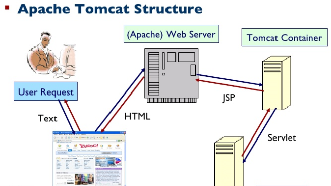

#### Tomcat简介

Tomcat是Apache 软件基金会（Apache Software Foundation）的Jakarta 项目中的一个核心项目，由Apache、Sun 和其他一些公司及个人共同开发而成。由于有了Sun 的参与和支持，最新的Servlet 和JSP 规范总是能在Tomcat 中得到体现，因为Tomcat 技术先进、性能稳定，而且免费，因而深受Java 爱好者的喜爱并得到了部分软件开发商的认可，成为目前比较流行的Web 应用服务器。

- Tomcat是Apache开源的免费的web应用服务器，开发语言：Java

- Tomcat服务器安装说明

  - 路径要求：不要有中文/空格/特殊字符
  - Tomcat服务器目录结构

  | 目录    | 作用                               |
  | ------- | ---------------------------------- |
  | bin     | 存放启动、停止服务器和其他脚本文件 |
  | conf    | 存放服务器的配置文件               |
  | lib     | 存放tomcat服务器的jar包            |
  | logs    | 存放tomcat服务器的日志文件         |
  | temp    | 存放tomcat临时文件                 |
  | webapps | web应用的部署目录                  |
  | work    | tomcat工作目录                     |

  - Tomcat服务器默认加载项目说明
    - 默认项目名称必须为ROOT

- Tomcat服务器启动说明

  - 网址：http://localhost 或者 127.0.0.1
  - 端口号：
    - http：默认端口号80
    - https：默认端口号443
    - tomcat服务器：默认端口号8080

- Tomcat服务器修改端口号，编辑server.xml配置文件

