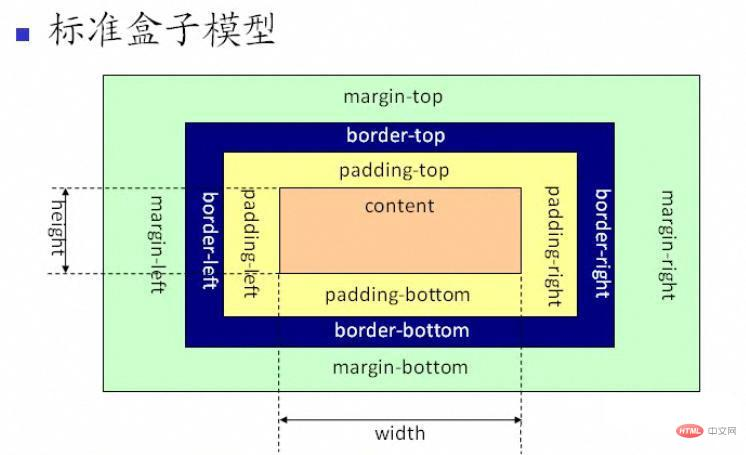

### CSS

- css指的是层叠样式表（Cascading Style Sheets）
- css描述了如何在屏幕或其他媒体上显示HTML元素
- css节省了大量工作。可以同时控制多张网页的布局

### css引入方式

#### 行内样式

通过style属性定义样式，只对当前行有效

```html
<p style="color: green; font-size=: 20px"> hello world </p>
```

#### 内部样式

一般是在当前页面的head标签中添加style标签，在style标签中编写css样式代码；内部样式仅对当前页面有效

**CSS语法**：

- CSS样式由选择器和声明组成，而声明又由属性和值组成
- 属性和值之间用冒号隔开
- 多条声明之间有分号隔开
- 使用/\*...*/声明注释

```html
<!DOCTYPE html>
<html lang="en">
    <!--head头标签-->
    <head>
        <!--mata指定字符集标签-->
        <meta charset="utf-8">
        <title>css样式</title>
        <style>
          p {
                color:green;
                font-size:25px;
                font-family: 宋体;
           }
        </style>
    </head>
    <body>
        <p style="color:red ; font-size:15px">hello world</p>
        <p>你好，世界！</p>
        <p>hello world！</p>
        <p>对酒当歌，人生几何？</p>
    </body>
</html>
```

#### 外部样式

- 创建css文件
- 定义css样式
- 外部样式引入：需要使用这个CSS文件的html的head标签内加入

```css
p{
    color:cadetblue;
    font-size: 35px;
    font-family: 华文行楷;
}
```

```html
<!DOCTYPE html>
<html lang="en">
    <!--head头标签-->
    <head>
        <!--mata指定字符集标签-->
        <meta charset="utf-8">
        <title>css样式</title>
        <link rel="stylesheet" type="text/css" href="css/color.css">
    </head>
    <body>
        <p style="color:red ; font-size:15px">hello world</p>
        <p>你好，世界！</p>
        <p>对酒当歌，人生几何？</p>
    </body>
</html>
```

### CSS选择器

```html
<!DOCTYPE html>
<html lang="en">
    <!--head头标签-->
    <head>
        <!--mata指定字符集标签-->
        <meta charset="utf-8">
        <title>css样式</title>
        <link rel="stylesheet" type="text/css" href="css/color.css">
    </head>
    <body>
        <p style="color:red ; font-size:15px">hello world</p>
        <p>你好，世界！</p>
        <p>对酒当歌，人生几何？</p>
        
         <div id="div1">id选择器</div>
         <div class="classdiv">类选择器1</div>
         <div class="classdiv">类选择器2</div>
    </body>
</html>
```

#### id选择器

指定元素id，定义元素样式，要求每个页面中id必须唯一

```css
/*id选择器*/
#div1{
  border: blue 1px dashed;
  width: 200px;
  height: 200px;
  background-color: yellowgreen;
  float: left;
}
```

#### 类选择器

通过class关键字，定义元素类型

```css
/*类选择器*/
.classdiv{
     border: blue 1px dashed;
            width: 200px;
            height: 200px;
            background-color: yellowgreen;
            float: left;
}
```

#### 元素选择器

通过定义标签的样式，展现效果

```css
/*元素选择器*/
p{
    color:cadetblue;
    font-size: 35px;
    font-family: 华文行楷;
}
```

### 盒子模型



#### margin关键字

- 使用margin关键字 表示外边距的位置

- 用法：
  - margin: 100px 100px 100px 100px：表示修饰上/右/下/左的数据
  - margin: 100px 100px 100px：表示修改上下100px 左右100px
  - margin: auto：表示左右居中

```html
<!DOCTYPE html>
<html lang="en">
    <head>
        <!--mata指定字符集标签-->
        <meta charset="utf-8">
        <title>盒子模型</title>
        <style type="text/css">
          #div1{
                width: 300px;
                height: 300px;
                background-color: paleturquoise;
                border: red 1px solid;
           }
          #div2{
            width:100px;
            height:100px;
            background-color:blue;
            margin:100px 100px 100px 100px;
/*            margin:aotu;*/
          }
        </style>
    </head>
    <body>
        <div id="div1">
            <div id="div2"></div>
        </div>
    </body>
</html>
```

#### padding关键字

- padding表示内边距，引入内边距会在谷歌浏览器中导致像素增加，所以计算时需要留意

```html
<!DOCTYPE html>
<html lang="en">
    <head>
        <!--mata指定字符集标签-->
        <meta charset="utf-8">
        <title>盒子模型</title>
        <style type="text/css">
          #div1{
                width: 300px;
                height: 300px;
                background-color: paleturquoise;
                border: red 1px solid;
                padding-top: 100px;
                padding-left: 100px;
           }
          #div2{
            width:100px;
            height:100px;
            background-color:blue;
/*            margin:100px 100px 100px 100px;*/
/*            margin:aotu;*/
          }
        </style>
    </head>
    <body>
        <div id="div1">
            <div id="div2"></div>
        </div>
    </body>
</html>
```

